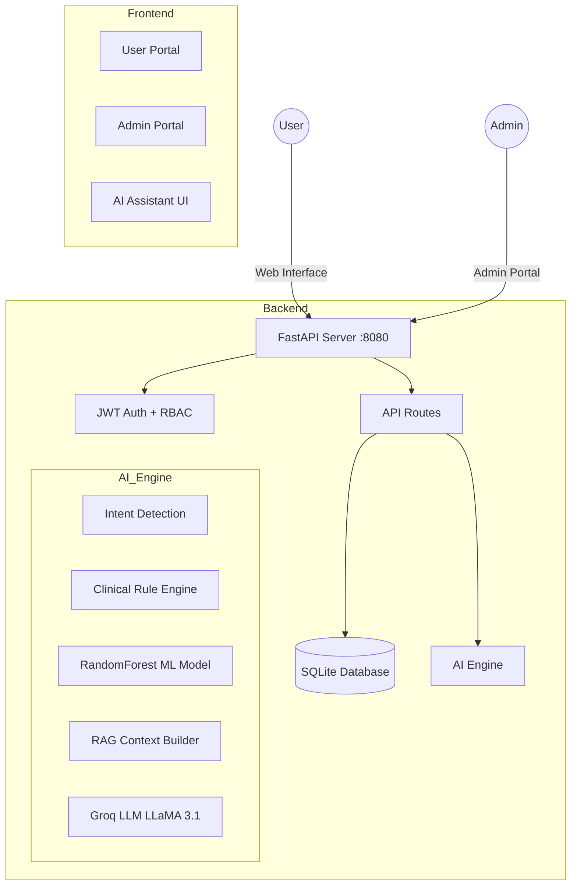

# 🥗 HealthBite Smart Canteen

**AI-Powered Health-Aware Canteen Management System**

HealthBite is a production-grade smart canteen system that combines clinical health scoring, machine learning food recommendation, and RAG-powered conversational AI to deliver personalized, medically safe nutrition guidance.

---

## ✨ Key Features

| Feature | Description |
|---|---|
| 🤖 **RAG AI Assistant** | Conversational chatbot powered by Groq LLM (LLaMA 3.1 8B) with retrieval-augmented generation — every response is grounded in real database data |
| 🏥 **Clinical Health Scoring** | 0–100 safety scores per food item based on user's diseases, allergies, and dietary preferences |
| 🧠 **ML Recommendations** | RandomForest classifier trained on user profiles to personalize food suggestions |
| 🍽️ **Smart Menu** | Full menu browsing with real-time health indicators and AI-powered safety ratings |
| 📊 **Health Analytics** | BMI tracking, consumption patterns, dietary trend analysis, and risk prediction |
| 🛒 **Order Management** | Complete ordering workflow with cart, payment, and order history |
| 🔐 **Role-Based Access** | Role-based authentication: User, Admin |
| 📱 **Responsive Design** | Modern glassmorphism UI optimized for desktop, tablet, and mobile |

---

## 🏗️ System Architecture



---

## 🤖 AI Architecture — Three-Layer System

### Layer 1: Intent Detection
Keyword-based NLP classifier that routes messages to the correct retrieval strategy.

| Intent | Keywords | Confidence |
|---|---|---|
| `greeting` | hello, hi, hey | 1.00 |
| `recommendation` | recommend, suggest, healthy, best food | 0.92 |
| `reasoning` | why, reason, avoid, not recommended | 0.90 |
| `general_chat` | *(fallback)* | 0.60 |

### Layer 2: Hybrid Health Scoring Engine
Combines clinical rules with ML to produce a 0–100 safety score per food.

**Clinical Rule Engine** — starts at 100, applies medical penalties:
- Diabetes: Sugar > 15g → −35 pts
- Hypertension: Sodium > 900mg → −35 pts
- Obesity: Calories > 550 → −28 pts
- Allergy match → −95 pts (hard block)
- Dietary mismatch → −80 pts (hard block)

**ML Model** — RandomForest (100 estimators) trained on 12 user features, outputs probability distribution across all menu items.

**Hybrid Formula:**
```
final_score = (rule_score × 0.75) + (ml_probability × 25.0)
```
Clinical safety always dominates — ML cannot rescue a dangerous food.

### Layer 3: Unified RAG LLM Engine
Every response is generated through **Retrieval-Augmented Generation** using Groq's LLaMA 3.1 8B model. The LLM never answers from its own knowledge — it receives pre-built context containing only real data from the HealthBite database.

| Scenario | Context Injected |
|---|---|
| Food inquiry ("Is pizza safe?") | Nutrition data + health score + cautions from DB |
| Recommendation ("Suggest lunch") | Top 3 scored foods with calories, protein, scores |
| Greeting ("hi") | Menu overview + warm greeting instructions |
| General chat | Up to 15 menu items + user profile context |

**Anti-Hallucination Safeguards:**
- Prompt instruction: "Do NOT invent medical facts or nutritional values"
- Database-only context injection
- Graceful fallback to hardcoded responses if LLM unavailable

---

## 📂 Project Structure

```
HEALTH-BITE_FINAL-main/
├── start_app.bat                 # One-click startup script
├── start_silent.vbs              # Background execution
├── enable_autostart.vbs          # Windows auto-start config
│
├── backend/
│   ├── app.py                    # FastAPI entry point (port 8080)
│   ├── auth.py                   # JWT authentication + role management
│   ├── database.py               # SQLAlchemy engine + session
│   ├── models.py                 # ORM models (User, FoodItem, Order, etc.)
│   ├── schemas.py                # Pydantic request/response schemas
│   ├── chatbot_engine.py         # ★ RAG chatbot engine (3-layer AI)
│   ├── chatbot.py                # Chatbot API route (/api/chatbot/query)
│   ├── health.py                 # Health profile API routes
│   ├── menu.py                   # Menu & ordering API routes
│   ├── analytics.py              # Health analytics & trend API
│   ├── .env                      # Environment variables (JWT key, Groq key)
│   ├── requirements.txt          # Python dependencies
│   │
│   ├── ai_engine/
│   │   ├── train_model.py        # ML training pipeline (RF/NB/DT benchmark)
│   │   ├── health_scoring.py     # Standalone health scoring module
│   │   ├── risk_prediction.py    # Dietary risk prediction engine
│   │   ├── recommendation_engine.py  # Menu recommendation engine
│   │   ├── food_recommender.pkl  # Trained ML model
│   │   ├── label_encoders.pkl    # Feature encoders
│   │   └── training_dataset.csv  # Training data
│   │
│   └── routes/
│       ├── admin_dashboard.py    # Admin dashboard stats
│       ├── admin_foods.py        # Food CRUD operations
│       ├── admin_inventory.py    # Inventory management
│       ├── admin_orders.py       # Order management
│       ├── admin_users.py        # User management
│       ├── admin_ai.py           # AI model monitoring
│       ├── admin_reports.py      # Report generation
│       └── admin_analytics_routes.py  # Analytics endpoints
│
└── frontend/
    ├── index.html                # Login / registration page
    ├── register.html             # User registration
    ├── user.html                 # User dashboard
    ├── full-menu.html            # Menu browsing + ordering
    ├── health-assistant.html     # ★ AI Assistant (ChatGPT-style UI)
    ├── health.html               # Health profile management
    ├── health-analytics.html     # Health analytics dashboard
    ├── recommendations.html      # AI food recommendations
    ├── cart.html                  # Shopping cart
    ├── payment.html              # Payment processing
    ├── orders.html               # Order history
    ├── script.js                 # Shared JS utilities
    ├── style.css                 # Global styles
    │
    └── admin/                    # Admin portal (role-restricted)
        ├── dashboard.html        # Admin dashboard
        ├── foods.html            # Menu management
        ├── inventory.html        # Stock management
        ├── orders.html           # Order oversight
        ├── users.html            # User management
        ├── ai-monitor.html       # ML model health monitoring
        └── reports.html          # Data export & reporting
```

---

## 🚀 Quick Start

### Prerequisites
- **Python 3.10+**
- **Groq API Key** (free at [console.groq.com](https://console.groq.com))

### Setup

```bash
# 1. Navigate to backend
cd backend

# 2. Install dependencies
pip install -r requirements.txt

# 3. Configure environment
# Edit .env and set your Groq API key:
#   GROQ_API_KEY=your-groq-api-key-here

# 4. Start the server
python app.py
```

Or simply **double-click** `start_app.bat` — it handles everything automatically.

### Access
- **Application:** http://localhost:8080
- **API Docs:** http://localhost:8080/docs

---

## ⚙️ Environment Configuration

Create or edit `backend/.env`:

```env
# JWT Configuration
JWT_SECRET_KEY=your-secret-key-here

# Email (for password reset)
MAIL_USERNAME=your-email@gmail.com
MAIL_PASSWORD=your-app-password
MAIL_FROM=your-email@gmail.com

# Groq LLM Configuration
GROQ_API_KEY=your-groq-api-key-here
```

---

## 🔐 Authentication & Roles

| Role | Access Level |
|---|---|
| `USER` | Dashboard, menu, ordering, AI assistant, health profile |
| `ADMIN` | All user features + admin dashboard, food/inventory/order management, users & AI monitoring |

**Security:** Passwords hashed with bcrypt via `passlib`. Sessions managed with JWT tokens via `python-jose`.

---

## 🎨 Frontend Pages

### User Portal

| Page | Purpose |
|---|---|
| `index.html` | Login / registration gateway |
| `user.html` | Personal dashboard with health overview |
| `full-menu.html` | Browse menu with real-time health safety indicators |
| `health-assistant.html` | **AI chatbot** — modern glassmorphism UI, centered search layout, suggestion pills |
| `health.html` | Health profile setup (age, BMI, diseases, allergies, diet) |
| `health-analytics.html` | BMI trends, consumption patterns, risk projections |
| `recommendations.html` | AI-generated personalized food recommendations |
| `cart.html` / `payment.html` | Shopping cart and checkout flow |
| `orders.html` | Order history and tracking |

### Admin Portal (`/admin/`)

| Page | Purpose |
|---|---|
| `dashboard.html` | Real-time stats, revenue, health alerts |
| `foods.html` | CRUD for menu items with nutrition data |
| `inventory.html` | Stock levels and replenishment |
| `orders.html` | Order oversight and management |
| `users.html` | User accounts and role assignment |
| `ai-monitor.html` | ML model accuracy and health metrics |
| `reports.html` | Export consumption trends and analytics |

---

## 📡 API Endpoints

### Core APIs

| Method | Endpoint | Description |
|---|---|---|
| POST | `/api/auth/register` | User registration |
| POST | `/api/auth/login` | Authentication (returns JWT) |
| GET | `/api/menu/` | Get available menu items |
| POST | `/api/menu/order` | Place an order |
| POST | `/api/chatbot/query` | AI assistant query (RAG engine) |
| GET | `/api/health/profile` | Get user health profile |
| POST | `/api/health/profile` | Update health profile |
| GET | `/api/health/analytics` | Health analytics data |
| POST | `/api/recommendations` | ML-powered food recommendations |

### Admin APIs

| Method | Endpoint | Description |
|---|---|---|
| GET | `/api/admin/dashboard` | Dashboard statistics |
| CRUD | `/api/admin/foods/*` | Menu item management |
| CRUD | `/api/admin/inventory/*` | Inventory management |
| GET | `/api/admin/analytics/*` | Analytics endpoints |
| GET | `/api/admin/ai/*` | AI model monitoring |

---

## 🛠️ Technology Stack

| Layer | Technology |
|---|---|
| **Backend** | Python 3.10+, FastAPI, Uvicorn |
| **Database** | SQLite + SQLAlchemy ORM |
| **ML** | scikit-learn (RandomForest, GaussianNB, DecisionTree) |
| **LLM** | Groq Cloud API — LLaMA 3.1 8B Instant |
| **Auth** | python-jose (JWT) + passlib (bcrypt) |
| **Data** | Pandas, NumPy, joblib |
| **Frontend** | HTML5, CSS3, Vanilla JavaScript |
| **Email** | FastAPI-Mail + Jinja2 templates |

---

## 📊 Data Flow Example

**User asks:** *"Is pizza safe for me?"*
**Profile:** Diabetes, Vegetarian

```
1. Intent Detection    → general_chat (0.60)
2. Food Extraction     → "Pizza" matched in menu DB
3. Rule Engine         → Sugar 12g (ok), Sodium 950mg (−35), Not Veg (−80)
4. ML Probability      → 0.15 → contributes 3.75 pts
5. Hybrid Score        → (−15 × 0.75) + 3.75 = −7.5 → clamped to 0
6. RAG Context         → All nutrition + score + cautions packed
7. LLM Response        → "Pizza is not recommended for your profile..."
```

---

## 🚢 Deployment Options

| Method | Command / Action |
|---|---|
| **Quick Start** | Double-click `start_app.bat` |
| **Background** | Run `start_silent.vbs` (no terminal window) |
| **Auto-Start** | Run `enable_autostart.vbs` (launches on Windows boot) |
| **Manual** | `cd backend && python app.py` |
| **Remote Access** | Run `enable_remote_access.bat` for LAN access |

> [!NOTE]
> The server runs on **port 8080** and binds to `0.0.0.0` (accessible from any device on the network).

> [!WARNING]
> For public internet deployment, use a reverse proxy (Nginx) with SSL/TLS certificates. Never expose the development server directly.

---

## 📄 License

This project is developed as a production-grade smart canteen solution for institutional use.

---

## 🧬 Comprehensive Technical Report (Architecture, Models & Algorithms)

This section provides an exhaustive breakdown of every technology, model, and algorithm actively running within the HealthBite Smart Canteen ecosystem.

### 1. Overall System Architecture
HealthBite follows a modern decoupling pattern. The backend acts as an intelligent API layer handling data storage, authentication, and core business/AI logic, while the frontend is a lightweight, static client that renders the UI and communicates strictly via RESTful endpoints.
- **Communication Protocol**: HTTP/HTTPS REST APIs.
- **Data Exchange Format**: JSON.
- **State Management**: Stateless backend. Sessions are managed entirely on the client side via JWT stored in browser `localStorage`.

### 2. Backend & AI Engine (`backend/`)
The backend is modularized, blending traditional CRUD endpoints with a sophisticated multi-layered AI Engine.

#### 2.1 Core Backend Technologies
*   **FastAPI** (`app.py`): Handles asynchronous performance and routing.
*   **SQLite 3 & SQLAlchemy**: Database engine and ORM managing Users, Foods, Profiles, Orders, and AI Logs.
*   **Pydantic**: Data validation for incoming JSON queries and responses.
*   **JWT & Bcrypt**: Handles Authentication, password hashing, and role-based access control.

#### 2.2 The AI Engine (`backend/ai_engine/`)
*   **Deterministic Health Risk Scoring (`health_scoring.py`)**: A rule-based algorithm evaluating foods against health profiles (Diabetes, Hypertension, Allergies), starting at 100 points and deducting based on strict medical penalty thresholds (e.g., > 30g sugar deducts 50 points).
*   **ML Recommendation Engine (`recommendation_engine.py`)**: A **Random Forest Classifier** trained on user features (age, BMI, conditions) that outputs food probabilities. It is fused with the deterministic health score (75% Clinical, 25% ML weight) to ensure safety gates ML popularity.
*   **NLP & RAG Chatbot (`chatbot_engine.py`)**: A custom intent classifier routes the user's message. It uses **Groq Cloud (LLaMA 3.1 8B)** to generate responses dynamically from internal `Database Context` passed to it implicitly via Retrieval-Augmented Generation (RAG).

### 3. Frontend Architecture (`frontend/`)
*   **Technologies**: HTML5, Vanilla JS (ES6+), CSS3 (Glassmorphism UI), Chart.js.
*   **Component Structure**: 
    - `index.html` / `register.html`: Handles auth flow and JWT management.
    - `full-menu.html`: Renders the menu with dynamic API calls to fetch items and display their AI Health badges locally.
    - `health-analytics.html`: Fetches order trends and renders Chart.js visualizations.
    - `health-assistant.html` & `chatbot.js`: A specialized UI that intercepts Groq LLM API payload and transforms it into formatted markdown, explanation pills, and insight cards.
*   **Admin Dashboard (`admin/`)**: Secured JS routes that redirect non-admins. Acts as a CMS for managing food inventory, user database, and tracking the AI engine logs.

### 4. How They Connect (Data Flow)
**Example: Requesting an AI Food Recommendation**
1. User clicks "Recommend" → JS triggers a POST to `/api/recommend-food` with the JWT token.
2. Backend validates JWT, hydrates the request with user's full Health Profile from SQLite.
3. The AI Engine filters Lethal Allergies (Deterministic), calculates Nutritional Distances (Math), invokes `health_scoring.py` for health points, and queries the `food_recommender.pkl` Random Forest model.
4. The Engine fuses the rankings, formats an XAI (Explainable AI) trace, logs the action into SQLite, and returns the top 5 matches.
5. Frontend parses the JSON response and dynamically draws customized glassmorphism cards explaining exactly why the food was selected.

---

*Built with ❤️ using FastAPI, scikit-learn, and Groq AI*
