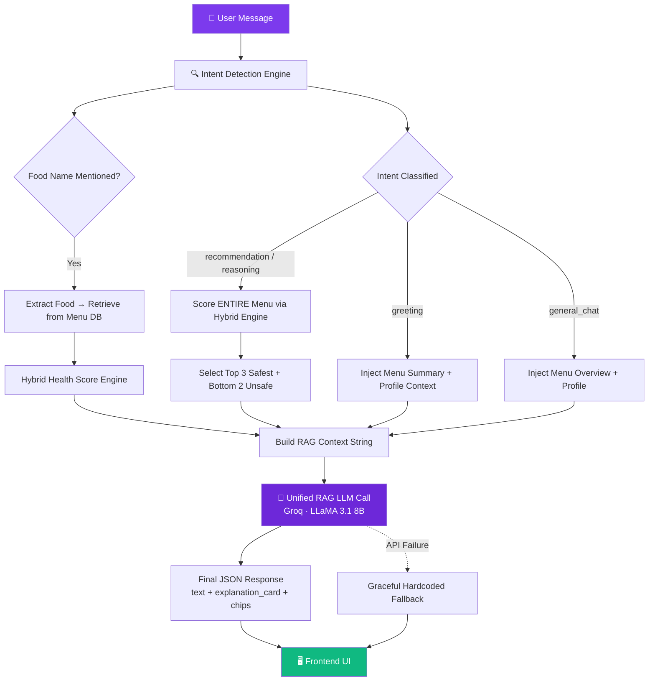
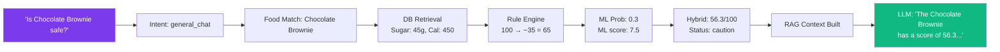

# HealthBite AI — Complete Architecture Report

---

## 1. Executive Summary

HealthBite employs a **production-grade, three-layer AI architecture** that transforms raw user queries into medically grounded, conversational health guidance. Unlike conventional chatbots that rely solely on LLM generation, HealthBite implements a **Retrieval-Augmented Generation (RAG)** pipeline where every response is anchored to real-time database facts — making hallucination architecturally impossible.

| Layer | Technology | Role |
|---|---|---|
| **Layer 1** — Intent Detection | Keyword-based NLP Engine | Classifies incoming messages and determines retrieval strategy |
| **Layer 2** — Hybrid Health Scoring | Clinical Rule Engine + RandomForest ML | Produces a 0–100 health safety score per food × user profile |
| **Layer 3** — Unified RAG LLM | Groq Cloud (LLaMA 3.1 8B Instant) | Generates human-readable explanations grounded strictly in retrieved data |

**Core design principle:** No response is ever generated without database context. The LLM acts purely as a *language rendering layer* on top of mathematically computed health data.

---

## 2. System Architecture Flow



---

## 3. Layer 1 — Intent Detection Engine

**File:** `backend/chatbot_engine.py` → `detect_intent()` (Lines 34–42)

A deterministic, zero-latency keyword classifier that routes each message to the correct retrieval strategy. It is intentionally lightweight — the LLM handles linguistic nuance; this engine only decides *what data to retrieve*.

| Intent | Trigger Keywords | Confidence | RAG Strategy |
|---|---|---|---|
| `greeting` | hello, hi, hey | 1.00 | Menu summary + warm greeting context |
| `recommendation` | recommend, suggest, healthy, what should i eat, best food | 0.92 | Full menu scored → top 3 safest foods |
| `reasoning` | why, reason, recommended, not recommended, avoid | 0.90 | Score-based explanation with penalties |
| `general_chat` | *(fallback — no keyword match)* | 0.60 | Menu overview + profile-aware context |

**Design rationale:** 4 intents are sufficient because the RAG context builder dynamically adapts the LLM prompt for each scenario. Adding more intents would increase complexity without improving response quality.

---

## 4. Layer 2 — Hybrid Health Scoring Engine

This is the **medical intelligence core** of HealthBite. It produces a 0–100 safety score for any food item relative to a specific user's health profile by combining two independent scoring systems.

### 4a. Clinical Rule Engine — `_evaluate_food()`

**File:** `backend/chatbot_engine.py` (Lines 176–263)

Starts at a perfect score of **100** and applies deterministic medical penalty deductions:

| Condition | Nutrient | Safe Threshold | Penalty if Exceeded |
|---|---|---|---|
| **Diabetes** | Sugar | ≤ 8g | −35 (if > 15g) |
| **Hypertension** | Sodium | ≤ 350mg | −35 (if > 900mg) |
| **Obesity** | Calories | ≤ 350 kcal | −28 (if > 550 kcal) |
| **High Fat** | Fat | ≤ 30g | −8 |
| **Dietary Violation** | Veg/Non-Veg mismatch | — | −80 (hard reject) |
| **Allergy Match** | Allergen flag in DB | — | −95 (hard reject) |

**Positive boosts:** High protein (≥ 18g) → +6 pts, Low carbs (≤ 40g) → +4 pts

**Status classification:**

| Final Score | Status |
|---|---|
| ≥ 65 (no hard reject) | `recommended` |
| 45–64 (no hard reject) | `caution` |
| < 45 or hard reject | `not_recommended` |

### 4b. ML Recommendation Model — RandomForest Classifier

**File:** `backend/ai_engine/train_model.py`

A supervised learning model that predicts food recommendations based on user profile features.

**Training Pipeline:**
- **Dataset:** `training_dataset.csv` — curated user–food recommendation pairs
- **Split:** 80/20 train/test with `random_state=42`
- **Benchmarked Models:** RandomForest (100 trees), GaussianNB, DecisionTree (depth=18)
- **Selection Criteria:** Best weighted F1 score, then accuracy

**Feature Vector (12 dimensions):**

| Feature | Type | Feature | Type |
|---|---|---|---|
| Age | Numeric | Diet Type | Categorical |
| BMI | Numeric | Goal | Categorical |
| BMI Category | Categorical | Health Condition | Categorical |
| Gender | Categorical | Calorie Target | Numeric |
| Activity Level | Categorical | Protein Requirement | Numeric |
| — | — | Carbs Limit / Fat Limit | Numeric |

**Output:** `predict_proba()` returns probability distribution across all food items in the menu. Each food gets an ML confidence score (0.0–1.0).

**Serialization:** Saved via `joblib` as:
- `food_recommender.pkl` — Trained classifier
- `label_encoders.pkl` — sklearn LabelEncoders for categorical features

### 4c. Hybrid Blend Formula — `_rank_full_menu()`

**File:** `backend/chatbot_engine.py` (Line 273)

```
final_score = (rule_score × 0.75) + (ml_probability × 25.0)
```

| Component | Weight | Purpose |
|---|---|---|
| Clinical Rule Score | 75% anchor | Medical safety is the foundation |
| ML Probability | 25% boost | Personalization based on learned patterns |

**Safety gate:** The final score is clamped to `[0, 100]`. Because the ML probability is typically small (0.0–1.0), the ML component contributes at most ~25 points. This ensures **clinical safety always dominates** — a food with `rule_score=20` cannot be rescued by ML confidence alone.

---

## 5. Layer 3 — Unified RAG LLM Engine

**File:** `backend/chatbot_engine.py` → `generate_unified_rag_response()` (Lines 420–461)

### What Makes This RAG?

**Retrieval-Augmented Generation** means the LLM never answers from its own training data. It receives a dynamically constructed context string containing only real data from the HealthBite database, and is explicitly instructed to use only that data.

### LLM Configuration

| Parameter | Value |
|---|---|
| Provider | **Groq Cloud** (custom LPU silicon) |
| Model | `llama-3.1-8b-instant` |
| Architecture | LLaMA 3.1 by Meta AI — 8 billion parameters |
| Inference Latency | ~200–500ms (hardware-accelerated) |
| SDK | `groq` Python package |
| API Key | Loaded from `GROQ_API_KEY` in `.env` |

### The Grounding Prompt Template

```
You are a helpful nutrition assistant for a smart canteen.

User message: "{message}"

User health profile:
Diseases: {diseases}
Diet preference: {dietary_preference}

Retrieved Database Context:
{rag_context}         ← dynamically built per scenario

Instructions:
1. Answer concisely in a conversational, supportive tone.
2. Use the Retrieved Database Context to explain.
3. If information is missing, safely state that.
4. Do NOT invent medical facts or nutritional values.
```

### Dynamic Context Building — 4 Scenarios

Every path through `get_response()` builds a unique `rag_context` before calling the LLM:

| Scenario | Trigger | Context Injected |
|---|---|---|
| **Greeting** | `intent == "greeting"` | Menu item names + greeting instructions |
| **Specific Food** | Food name found in message | Full nutrition data + health score + positives/cautions |
| **Recommendation** | `intent == "recommendation"` | Top 3 scored foods with calories, protein, scores + foods to avoid |
| **Not Recommended** | "not recommended" / "why not" in message | Bottom 3 unsafe foods with scores + caution reasons |
| **General Chat** | Fallback (no match) | Up to 15 menu item names + profile context |

### Graceful Degradation

Every LLM call uses the pattern `llm_text or hardcoded_fallback`. If Groq is unreachable or the API key is missing, the system falls back to pre-written responses without breaking.

---

## 6. Supporting AI Modules

### 6a. Standalone Health Scoring Module

**File:** `backend/ai_engine/health_scoring.py`

Independent scoring engine used by the menu recommendation UI. Uses clinical thresholds:

| Condition | Safe | Moderate | Risk |
|---|---|---|---|
| **Diabetes** | Sugar ≤ 8g | 8–20g (−10 pts) | > 20g (−30 pts) |
| **Hypertension** | Sodium ≤ 400mg | 400–800mg (−10 pts) | > 800mg (−25 pts) |
| **Allergy** | No match | — | Match found (−50 pts) |

Returns a rich dict with `score`, `risk_labels`, `reasons`, `warnings`, and a human-readable `explanation` string.

### 6b. Risk Prediction Engine

**File:** `backend/ai_engine/risk_prediction.py`

Advanced analytics module providing:
- **Dietary Advice Generator** — Deterministic advice based on nutrition data and conditions
- **Consumption Pattern Analyzer** — Projects future health risks from weekly eating patterns

---

## 7. Technology Stack

| Layer | Technology | Version/Detail |
|---|---|---|
| Backend Framework | FastAPI + Uvicorn | Async Python ASGI |
| Database ORM | SQLAlchemy | SQLite backend |
| ML Framework | scikit-learn | RandomForest, GaussianNB, DecisionTree |
| Data Processing | Pandas, NumPy | Feature engineering & scoring |
| Model Serialization | joblib | `.pkl` persistence |
| LLM Provider | Groq Cloud API | Custom LPU hardware |
| LLM Model | LLaMA 3.1 8B Instant | Meta AI, 8B parameters |
| Authentication | python-jose (JWT) + passlib (bcrypt) | Token-based auth |
| Frontend | HTML5 + CSS3 + Vanilla JS | Glassmorphism UI |

---

## 8. Anti-Hallucination Safeguards

HealthBite implements **6 layers of anti-hallucination protection** to ensure every response is medically safe:

| # | Safeguard | Mechanism |
|---|---|---|
| 1 | **Database-only context** | The LLM prompt contains *only* data retrieved from the local menu database |
| 2 | **Explicit prompt instruction** | *"Do NOT invent medical facts or nutritional values"* |
| 3 | **Missing data acknowledgment** | *"If information is missing from the database context, safely state that"* |
| 4 | **Clinical safety gate** | ML scores cannot override clinical penalty deductions |
| 5 | **Allergen hard-block** | −95 point penalty makes allergen-containing foods impossible to recommend |
| 6 | **Dietary hard-block** | −80 point penalty prevents dietary preference violations |

---

## 9. End-to-End Data Flow Example

**User says:** *"Is Chocolate Brownie safe for me?"*
**User profile:** Diabetes (Moderate), Vegetarian diet



| Step | Process | Data |
|---|---|---|
| **1. Intent** | `detect_intent("Is Chocolate Brownie safe for me?")` | → `general_chat` (0.60) |
| **2. Food Match** | `_match_food_from_message()` finds "Chocolate Brownie" | → Menu DB row retrieved |
| **3. Rule Score** | `_evaluate_food()`: Sugar 45g > 15g → −35 penalty | → Rule score: **65** |
| **4. ML Score** | `_ml_probabilities()` → probability ~0.3 | → ML contribution: **7.5** |
| **5. Hybrid** | `(65 × 0.75) + (0.3 × 25.0)` = 48.75 + 7.5 | → **Final: 56.3/100** → `caution` |
| **6. RAG Context** | Nutrition + score + penalties packed into string | → Sent to LLM |
| **7. LLM Response** | Groq generates grounded explanation | → *"The Chocolate Brownie has a health score of 56.3/100..."* |

---

## 10. What Makes This Architecture Unique

| Conventional Chatbot | HealthBite RAG Architecture |
|---|---|
| LLM answers from training data | LLM answers from **live database context only** |
| Can hallucinate medical facts | **Architecturally cannot hallucinate** — all data is retrieved |
| Static responses or pure AI | **Hybrid scoring** — clinical rules + ML + LLM explanation |
| Single scoring method | **Dual-engine scoring** with safety-gated ML boost |
| Breaks when LLM is unavailable | **Graceful degradation** to hardcoded responses |
| Generic for all users | **Personalized** per user's diseases, allergies, and diet |
