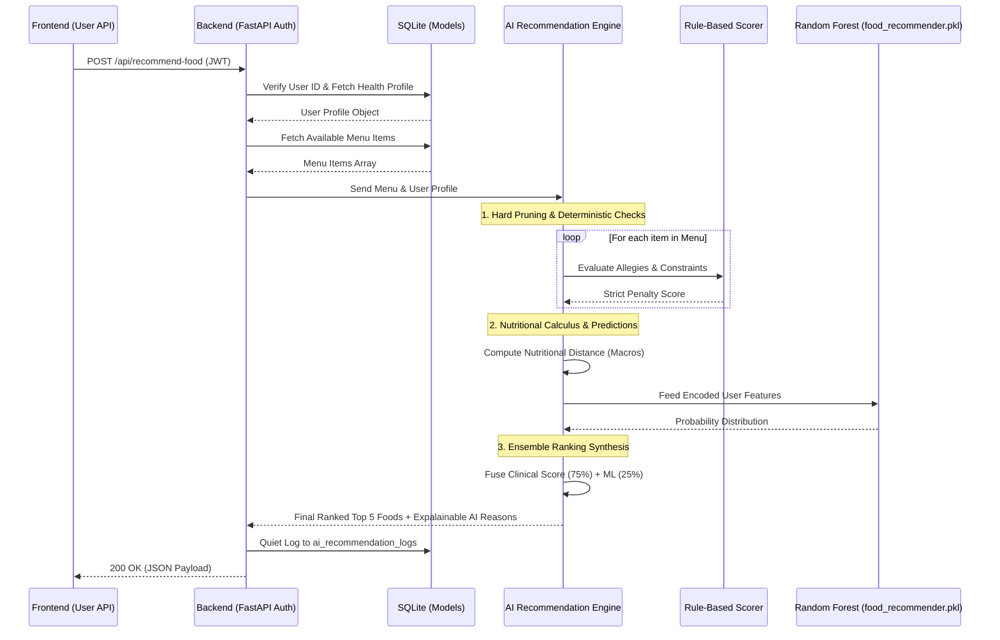
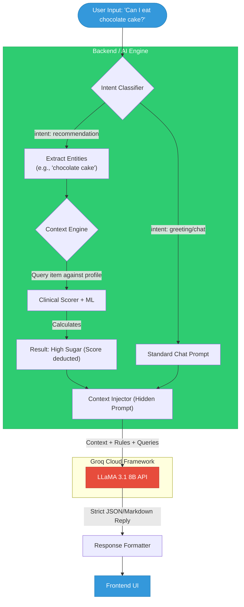
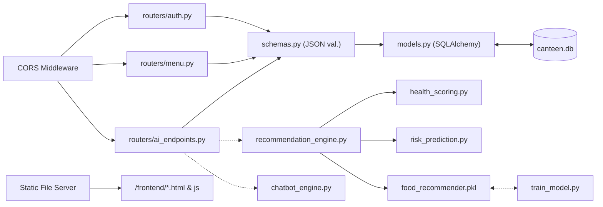

# Deep Dive: HealthBite System Architecture

Here is a deeper technical breakdown of the HealthBite Smart Canteen ecosystem, zooming into the specific data flows and modular layers of the application.

## 1. AI Food Recommendation Pipeline (Sequence Diagram)

This sequence diagram illustrates the complex flow of a user asking for food recommendations. It highlights the orchestration between the Fast API backend and the multi-layered AI Engine.

## 2. Hybrid NLP & RAG Chatbot Pipeline

This diagram shows how HealthBite ensures zero-hallucination medical advice by using a RAG (Retrieval-Augmented Generation) pipeline before querying the LLaMA model from Groq Cloud.

## 3. Infrastructure & Component Map

Unlike the broad overview, this map zooms into the specific libraries, directories, and structural responsibilities of the backend ecosystem.

### Deep Dive Explanations
*   **Explainable AI (XAI)**: When the Random Forest model and Clinical Scorer evaluate a food item, they don't just return a boolean `True/False` or a raw percentage match. They generate strings justifying the penalty (e.g., "(High Sugar)"). The system guarantees the user knows *why* food was rejected. 
*   **Ensemble Weighting Mechanism**: In the backend's recommendation engine, the final rank prioritizes clinical math over pure ML averages entirely. A 75% focus is given to strict health threshold calculations (`health_scoring.py`) versus the 25% focus on statistical popularity among similar users predicted by `food_recommender.pkl`. This is a hard guardrail.
*   **Role-Based Security Hooks**: By decrypting JWTs on every route payload locally, both the `backend/auth.py` router *and* the physical frontend UI panels (like `frontend/admin/script.js`) can simultaneously check roles (e.g., preventing a non-admin from visualizing the `ai_recommendation_logs` board).
