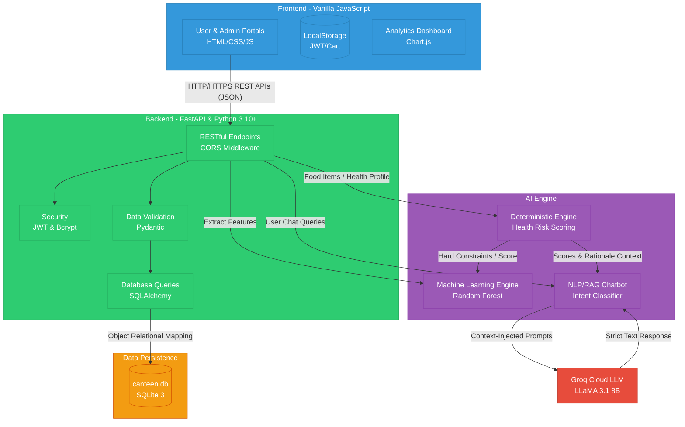

# HealthBite System Architecture

Based on the project's deep technical documentation, here is the full system architecture diagram for HealthBite, utilizing a decoupled frontend-backend pattern and incorporating a specialized multi-layer AI Engine.

## System Architecture Diagram

## Component Breakdown

1. **Frontend**: Lightweight vanilla implementation ensuring maximal speed. Uses HTTP requests to communicate with the application layer and `localStorage` to retain session keys locally without holding state on the central server.
2. **Backend**: Python-powered FastAPI routing application served by Uvicorn. Validates requests precisely with Pydantic and utilizes SQLAlchemy for abstracted database interactions.
3. **Data**: A local and lightweight SQLite 3 database keeping track of users, biometric profiles, menu catalog, historical orders, and logging AI prediction accuracy.
4. **AI Engine**: A hybrid system blending explicit clinical safety thresholds (deterministic python scripts) with a probabilistic Scikit-Learn Random Forest recommendation model. It employs Retrieval-Augmented Generation to fetch safety metrics into a hidden prompt format, communicating with the Groq Cloud LLaMA model to reply conversationally yet securely.
