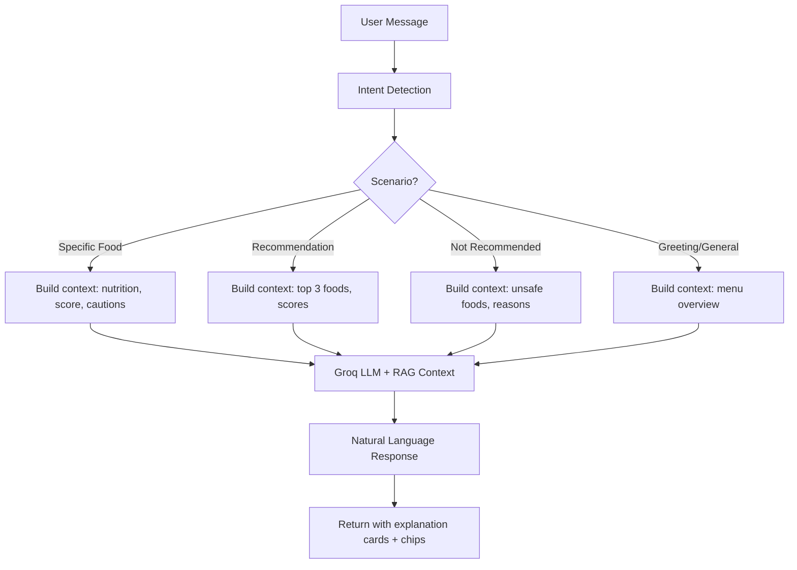

# HealthBite — Changes Walkthrough

## 1. UI Redesign — AI Assistant Page

Redesigned [health-assistant.html](file:///h:/HEALTH-BITE_FINAL-main%20FIXY%20(2)/HEALTH-BITE_FINAL-main%20FIXY/HEALTH-BITE_FINAL-main/frontend/health-assistant.html) from a sidebar+chat layout to a **modern AI search interface** (ChatGPT/Perplexity style).

| Feature | Detail |
|---|---|
| **Landing** | Centered layout, gradient title, glassmorphism input, suggestion pills |
| **Chat Mode** | Smooth transition on first message, top bar + bottom input |
| **Background** | Lavender→purple gradient with animated floating orbs |
| **Responsive** | Desktop, tablet, mobile support |

---

## 2. RAG + LLM Integration — Groq

Integrated **Groq's llama-3.1-8b-instant** into [chatbot_engine.py](file:///h:/HEALTH-BITE_FINAL-main%20FIXY%20(2)/HEALTH-BITE_FINAL-main%20FIXY/HEALTH-BITE_FINAL-main/backend/chatbot_engine.py) with a RAG (Retrieval-Augmented Generation) architecture.

### Flow

### Files Modified

| File | Change |
|---|---|
| [chatbot_engine.py](file:///h:/HEALTH-BITE_FINAL-main%20FIXY%20(2)/HEALTH-BITE_FINAL-main%20FIXY/HEALTH-BITE_FINAL-main/backend/chatbot_engine.py) | Added [generate_unified_rag_response()](file:///h:/HEALTH-BITE_FINAL-main%20FIXY%20%282%29/HEALTH-BITE_FINAL-main%20FIXY/HEALTH-BITE_FINAL-main/backend/chatbot_engine.py#421-462), rewrote [get_response()](file:///h:/HEALTH-BITE_FINAL-main%20FIXY%20%282%29/HEALTH-BITE_FINAL-main%20FIXY/HEALTH-BITE_FINAL-main/backend/chatbot_engine.py#464-623) with 4 RAG scenarios |
| [.env](file:///h:/HEALTH-BITE_FINAL-main%20FIXY%20(2)/HEALTH-BITE_FINAL-main%20FIXY/HEALTH-BITE_FINAL-main/backend/.env) | Added `GROQ_API_KEY` placeholder |
| [requirements.txt](file:///h:/HEALTH-BITE_FINAL-main%20FIXY%20(2)/HEALTH-BITE_FINAL-main%20FIXY/HEALTH-BITE_FINAL-main/backend/requirements.txt) | Added `groq` |

### Anti-Hallucination

The LLM prompt explicitly includes:
- Real nutrition data from the database (calories, sugar, sodium, protein)
- Pre-calculated health scores and clinical penalties
- Instruction: "Do NOT invent medical facts or nutritional values"

### Setup Required

> [!IMPORTANT]
> Replace `your-groq-api-key-here` in [.env](file:///h:/HEALTH-BITE_FINAL-main%20FIXY%20%282%29/HEALTH-BITE_FINAL-main%20FIXY/HEALTH-BITE_FINAL-main/backend/.env) with your real key from [console.groq.com](https://console.groq.com). The `groq` package is already installed.
